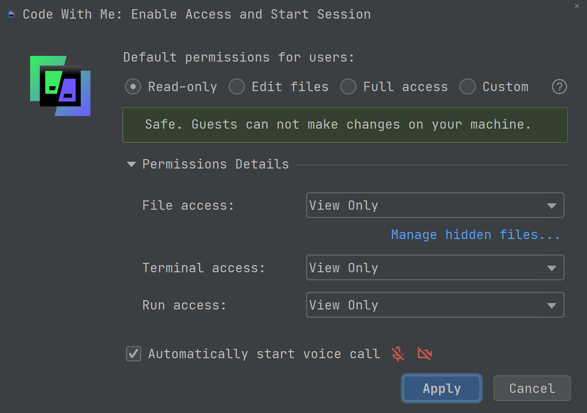

# What's New In 2020.3

This is a collection of new features in GoLand 2020.3.

Some of these are listed here, some have their own separate demo,
for the convenience of showing the feature itself.

- [Go 1.16 support](#go-116-support)
- [Go Debugger](#go-debugger)
- [Go Testing](#go-testing)
- [Go Inspections](#go-inspections)
- [Go Code Editing](#go-code-editing)
- [Go Modules](#go-modules)
- [General UI/UX Improvements](#general-uiux-improvements)
- [Web Support](#web-support)
- [Database Support](#database-support)
- [Version Control](#version-control)
- [Markdown Plugin](#markdown-plugin)
- [Kubernetes Plugin](#kubernetes-plugin)
- [Grazie Plugin](#grazie-plugin)
- [Code With Me](#code-with-me)

## Go 1.16 support

01. Support for new `GOOS` and `GOARCH` environment variables.
    You can switch to them if you use a Go 1.16 SDK and visit
    the [Settings/Preferences | Go | Build Tags & Vendoring](jetbrains://GoLand/settings?name=Go--Build+Tags+%26+Vendoring).
    
    For a list of new architectures, see the [Go 1.16 Release Notes](https://tip.golang.org/doc/go1.16#ports).
02. Support for `retract` directive in `go.mod` files.
    [Demo](02%20-%20retract/go.mod)

## Go Debugger

03. Use `Dump Goroutines` action from the debugger to observe your app at runtime.
    [Demo](03%20-%20dump%20goroutines/main.go)
04. `Go Remote` Run Configuration can now, optionally, end the debug target.
    [Demo](04%20-%20go%20remote%20changes/main.go)
05. You can add an Inline Watches to your code.
    You can also expand the value of the inline displayed symbol.
    [Demo](05%20-%20debug%20watches/main.go)

## Go Testing

06. Run and navigate to individual test in a table test format.
    [Demo](06%20-%20table%20testing/main_test.go)
07. Testify support improvements.
    [Demo](07%20-%20testify/main_test.go) 

## Go Inspections

08. The `Incorrect usages of Println/Printf-like functions` inspection 
    was extended to support the following packages:
    - github.com/pkg/errors
    - github.com/sirupsen/logrus
    - go.uber.org/zap
    
    [Demo](08%20-%20extended%20printf%20inspection/main.go)
09. A new inspection scans for `context.CancelFunc`, and similar, calls
    and reports potential issues from paths not calling the "cancel" function.
    [Demo](09%20-%20context%20cancel/main.go)

## Go Code Editing

10. Improved `time` package support.
    [Demo](10%20-%20better%20time/main.go)
11. Suggestions for auto-imports and Completion for import paths
    now takes frequency of usage and presence in go.mod into account.
12. Improved variable shadowing support.
    [Demo](12%20-%20variable%20shadowing/main.go)
13. Support for square brackets for the Generics syntax.
    [Demo](13%20-%20generics/main.go2)
14. Two new `bench` and `test` Live Templates in `_test.go` files.
    [Demo](14%20-%20bench%20test/main_test.go)
15. The IDE suggests a `for` loop with `b.N` when you type `for` inside a benchmark.
    [Demo](15%20-%20bench%20for%20loop/main_test.go)

## Go Modules

16. Vendored dependencies of Go modules are no longer shown in `External Libraries`.
    [Demo](16%20-%20better%20vendor/main.go)
17. References resolution now works as expected, mirroring Go's behavior.

## General UI/UX improvements

18. The Welcome Screen has a new Look & Feel!
19. Drag and drop tabs anywhere to split the editor.
    Or use `Shift + Enter` to open a file in a new split editor.
20. You can set up your IDE to open files in a Preview Tab with a single click.
21. The `Sync with OS`, [Settings/Preferences | Appearance & Behavior | Appearance](jetbrains://GoLand/settings?name=Appearance+%26+Behavior--Appearance),
    option allows you to synchronize the IDE theme with OS one.
22. Read-only files and files from `External Libraries` now use the new `Reader Mode`,
    [Settings/Preferences | Editor | Reader Mode](jetbrains://GoLand/settings?name=Editor--Reader+Mode),
23. `Search Everywhere`, `Shift + Shift`, now does simple math.
    It can also search for Git commit messages, branches or tags.
24. [LightEdit mode](https://www.jetbrains.com/help/go/lightedit-mode.html)
    now supports the `-e(–edit)` command.
25. Better Flame Graph support in the Profiler. (works in Go too).
26. Plugins can now be enabled per project or the whole IDE.
27. A new "system shortcut" keymap for macOS that provides extended compatibility with system shortcuts.

## Web Support

For even more tips, visit [WebStorm 2020.3 Release Blog Post](https://blog.jetbrains.com/webstorm/2020/11/webstorm-2020-3/)

28. Tailwind CSS support.
    [Demo](28%20-%20tailwind/src/index.css).
29. Better Vue3 support.
    [Demo](28%20-%20tailwind/src/main.js).
30. Other improvements to frameworks and technologies.
31. The Problems Tool Window now displays TypeScript issues from the language server.
32. Create a React component from an unresolved reference via `Alt + Enter`.
33. Full support for [pnpm](https://pnpm.js.org/).
34. Basic support for multiple `webpack` [configs](https://webpack.js.org/concepts/configuration/).

## Database Support

For even more tips, visit [DataGrip 2020.3 Release Blog Post](https://blog.jetbrains.com/datagrip/2020/11/25/datagrip-2020-3-sql-for-mongodb-azure-ad-auth-new-extractors-and-more/).

35. Couchbase support.
36. MongoDB databases can be queried using SQL.
    [Demo](36%20-%20mongosql/readme.txt)
37. Two new extractors are now available: One-Row and SQL-Insert-Multirow.
    [Demo](36%20-%20mongosql/readme.txt)
38. Support for grants in MySQL, PostgreSQL, Greenplum, Redshift, and SQL Server.
39. Improved separate editor for cell values.
    [Demo](36%20-%20mongosql/readme.txt)
    
## Version Control

40. The reworked VCS menu makes it easier to access key VCS features as they are no longer hidden in a submenu.
41. Git Staging Area support.
    
    Activate `Enable staging area` in [Settings/Preferences | Version Control | Git](jetbrains://GoLand/settings?name=Version+Control--Git) to start using it.
    
    In the commit UI, you will find staged and unstaged files.
    
    To stage a file, click the `+` icon next to it.
    The file will appear under the `Staged` node.
    You can also use the gutter icon or `Show Diff`.
    
    **Note**: This functionality is only available in the [Commit tool window](https://www.jetbrains.com/help/go/commit-and-push-changes.html#commit).

    **Note**: Support for [changelists](https://www.jetbrains.com/help/go/managing-changelists.html) will be disabled when using this feature.

## Markdown Plugin

42. The Markdown plugin now supports improved formatting features.
43. [Mermaid.js](https://mermaid-js.github.io/) can be rendered in Markdown files.
    [Demo](43%20-%20mermaid/readme.md)

## Kubernetes Plugin

44. Pod logs can now be downloaded.
    [Demo](44%20-%20kubernetes/db.yaml)
45. CRD schemas can be automatically loaded from an active cluster.
46. Open Console and Run Shell actions are now available.
    [Demo](44%20-%20kubernetes/db.yaml)

## Grazie Plugin

47. Improved spelling and grammar checkers, with better English support.
48. Added support for 10 additional languages.
    Check them out under [Settings/Preferences | Editor | Proofreading](jetbrains://GoLand/settings?name=Editor--Proofreading)

## Code With Me

49. Code With Me is new service from JetBrains for collaborative development and pair programming.

It lets you work with others on the same project by sharing it in real-time.

You can control the sharing permissions, as shown in the image below.

To access it, use `Search Everywhere`, by tapping `Shift + Shift`, and
look out for `En acc`, or `Enable Access and Copy Invitation Link...`
if you prefer the longer version.

**Note** This service is, at least during 2020.3 release cycle,
in Early Access Program and is subject to change.

Your feedback is invaluable to the team to make the best possible
experience for you and those working with you.
